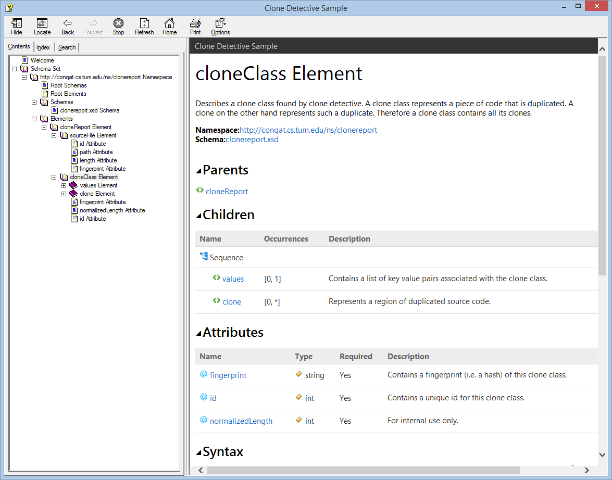

# XML Schema Documenter

XML Schema Documenter is a [Sandcastle Help File Builder][shfb] plug-in that
allows you to integrate reference documentation for XML schemas in your help
files.

## Features

* XML Schema Documenter allows you to easily create XML schema documentation by
  extending [Sandcastle Help File Builder][shfb].
* XML Schema Documenter automatically utilizes the standard
  [annotation Element](http://www.w3.org/TR/xmlschema-0/#CommVers) for summary
  documentation.
* You can leverage the power of Microsoft Assistance Markup Language (MAML) for
  documenting your XML schema items.
* Since XML Schema Documenter emits the documentation as MAML the output style
  is always consistent with the rest of your help file.
* You can document your XML schemas either inline or in an external
  documentation file.
* Using a custom XSLT transform you can easily create or reuse your own inline
  documentation format.
* You can effectively cross-link your XML schema with your MAML documentation
  using the MAML `link` element and the new `xmlEntityReference` element.

## Usage

 1. Install [Sandcastle Help File Builder (SHFB)][shfb]

    After the installation, you need to reboot the machine
    to make sure the new environment variables become
    available

 2. Install [XML Schema Documenter (XsdDoc)][xsddoc]

 3. Read the [documentation][docs]

## Development

### Prerequisites

 1. [Microsoft Visual Studio 2013 (Professional, Premium or Ultimate)][vs].

 2. [Sandcastle Help File Builder (SHFB)][shfb]

 3. [Windows Installer XML (WiX) toolset Version 3.8][wix]

### Building

1. Run `build.cmd`

2. The folder `bin` will now contain the following subfolders:
   - `help`. Contains the  help file.
   - `raw`. Contains the binaries (compiled in `Release` configuration).
   - `release`. Contains the zipped setup, samples, and source code.
   - `samples`. Contains several sample .chm files.
   - `setup`. Contains the setup.
   - `src`. Contains the complete source code.

[shfb]: http://shfb.codeplex.com/releases
[xsddoc]: https://github.com/terrajobst/xsddoc/releases
[docs]: docs/Documentation.md
[vs]: http://msdn.microsoft.com/en-us/vstudio/default.aspx
[wix]: http://wix.codeplex.com/releases/view/115492

### To be done

- `xmlEntityLink`: should render bold when the target is the current topic.
- Investigate how we can use shared content for localization
- Consider qualifying names within parents/usages so that they are unqiue.
- Redefinition?
- Substitution groups?
