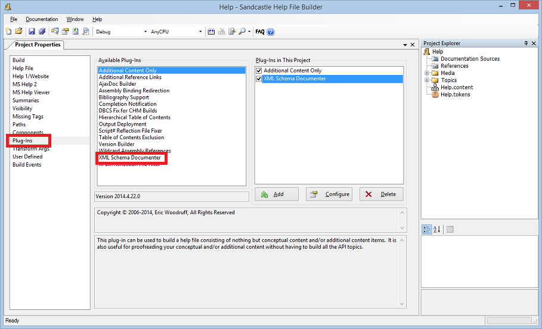
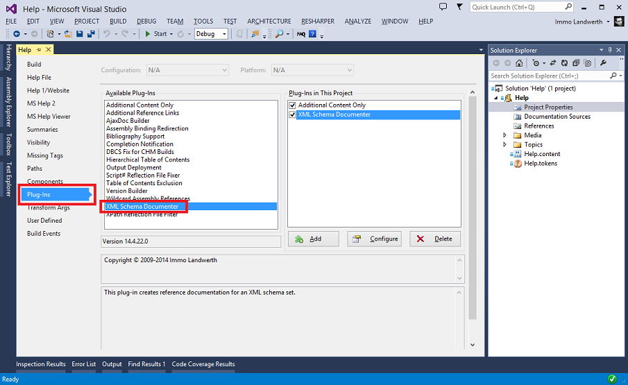
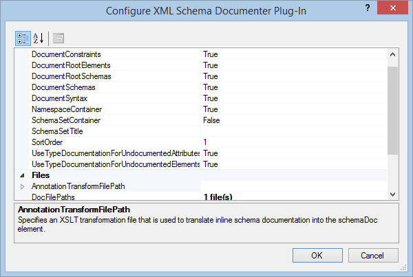

# Documentation

## Getting Started

### Installing Prerequisites

First, you need to download [Sandcastle Help File Builder (SHFB)][SHFB]. This
tool provides a guided installer package that allows you to properly install all
components required for Sandcastle and the help file builder. Make sure you
install the following components:

* Sandcastle Help File Builder
* At least one help compiler (HTML Help 1 or Microsoft Help 2)

### Installing XML Schema Documenter

After you installed SHFB make sure you reboot the machine. This is necessary to
ensure all environment variables added by the installer can be accessed. Then,
download and run the [XML Schema Documenter setup][XSDOC-Releases].

### Using the Plug-In

In order to use the plug-in, start SHFB and add the plug-in to your project:

In Visual Studio it looks similar:

## Documentation

The installation of the XML Schema Documenter plug-in comes with a comprehensive
help file that explains how XML schemas can be documented. It can be found here:

    %ALLUSERSPROFILE%\EWSoftware\Sandcastle Help File Builder\Components and Plug-Ins\XML Schema Documenter\Help.chm

You can also access the help from any of the dialogs provided by the plug-in by
clicking on the question mark icon:

[SHFB]: http://shfb.codeplex.com/releases
[XSDOC-Releases]: https://github.com/terrajobst/xsddoc/releases